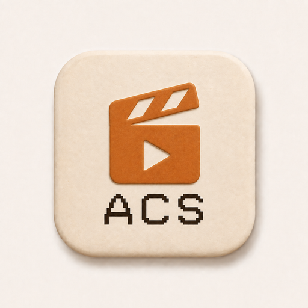

# Agentic Content System

Agentic Content System is a local-first, cloneable workspace for turning a
content decision and source material into reviewed content plus a supervised
publisher handoff.

ACS is deliberately small. It consists of skills, Markdown context and
templates, a versioned content graph, a supervised handoff, and focused
zero-dependency Node checks. It is not a media editor, render engine, Python
application, dashboard, database, or automatic publisher.

For ordinary video work, [Diffusion Studio](https://github.com/diffusionstudio/editor)
is the only normal Studio. ACS pins a thin reviewed fork of the upstream editor
and uses its Electron/DAPI workflow for owner-recorded long-form and shorts,
cuts, trims, audio/music, captions, overlays/assets, and supervised export. Its
loopback browser companion is read-only and human-facing. ACS records reviewed
outputs and lineage; it does not contain or reimplement the editor.

## Start

Requirements: Node.js 22 or newer and Git. Diffusion has its own pinned external
checkout and setup contract.

```text
npm test
npm run check:graph
npm run check:repository
```

For a real outcome:

1. Read `AGENTS.md` and the repository-local production skill.
2. Create `workspace/productions/<slug>/` only when a real content outcome
   exists.
3. Copy the content-graph and review templates, then replace fixture values with
   truthful production paths, hashes, provenance, relationships, and review
   state.
4. Use Diffusion for video editing and supervised export.
5. Validate the graph and optional handoff with the Node checker.
6. Hand off only independently approved nodes. Nothing posts automatically.

The normative contracts are in [Content graph](docs/CONTENT_GRAPH.md), the
workflow is in [Workflow](docs/WORKFLOW.md), and Studio setup/runtime is in
[Diffusion Studio](docs/DIFFUSION_STUDIO.md).

## Boundaries

- Optional local Whisper and reference-analysis helpers may use Python and
  FFmpeg, but they are preprocessing/research tools, not an ACS media pipeline.
- ADS is optional. An accepted immutable `DESIGN.md` plus selected assets may
  be hash-bound in a production, but ACS works without ADS.
- Upstream HeyGen HyperFrames is a specialist route only for a full
  code-animated video or bounded overlay asset. It is not another editor.
- Diffusion's Electron host and DAPI are authoritative. Codex may open the
  returned one-time loopback URL only in its built-in browser for read-only
  human inspection. macOS is the physically tested route; Linux and Windows
  command/path construction does not claim physical parity.

See [Real-video acceptance](docs/REAL_VIDEO_ACCEPTANCE.md) for the next
owner-recorded usability tracer. Generated fixtures prove contracts only.

<a href="assets/branding/acs-icon.png"></a>
